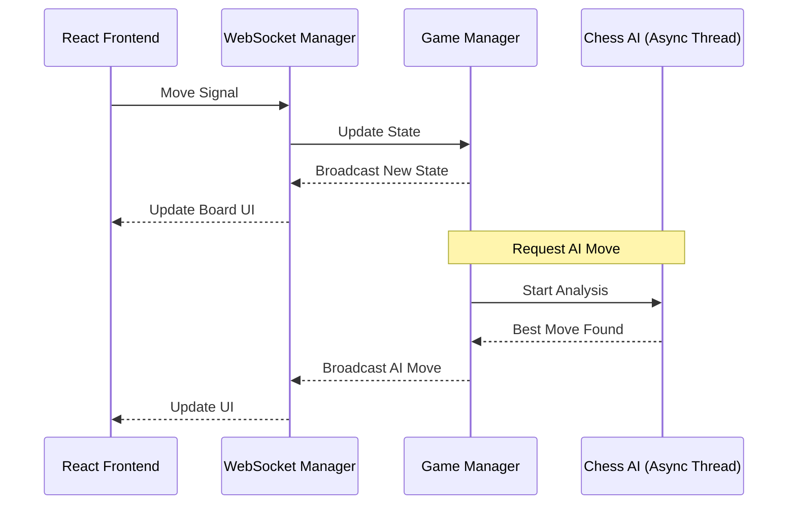

# ♚ Chess Master 2026


*Next-Generation Chess platform with Asynchronous AI, Opening Explorer, and a premium 2026 UI/UX.*

## 🌟 Overview
Chess Master 2026 is designed for players who demand precision, speed, and deep analytical capabilities. Built with a high-performance **FastAPI** backend and a reactive **TypeScript** frontend, the platform offers a seamless bridge between competitive play and disciplined study.

## 🤖 Advanced AI Architecture (Emphasis)
The core of Chess Master 2026 is its **Asynchronous AI Engine**. Unlike traditional chess apps that hang during calculations, our engine operates on a non-blocking thread pool.

### Key AI Features:
- **Zero-Latency UI**: The frontend remains 100% responsive while the AI calculates deep lines.
- **Minimax with Alpha-Beta Pruning**: Efficient move searching with optimized leaf evaluation.
- **Adaptive Difficulty**: Difficulty levels that adjust based on material balance and positional pressure.
- **Real-Time Evaluation**: A dedicated analysis thread feeds a visual evaluation bar every 500ms.

### Technical Flow:


---

## 🎓 Study Center & Academy
Master the game with our integrated educational suite.

### 📚 Chess Academy
- **Beginner**: Rules, piece values, and basic checkmates.
- **Intermediate**: Tactics (pins, forks, skewers) and endgame fundamentals.
- **Master**: Prophylaxis, pawn structures, and advanced theory.

### 🧭 Opening Explorer
- Access a database of over **3,000+ ECO-coded openings**.
- Real-time win/loss/draw statistics for every line.
- Practice mode to drill specific openings against the computer.

---

## 🎨 Professional UI/UX (2026 Aesthetics)
- **Glassmorphism**: Translucent interfaces with backdrop filters.
- **Micro-animations**: Floating hero elements and stagger-loaded grids.
- **Responsive Core**: Fully optimized for Desktop, Tablet, and Mobile.

---

## 🛠 Setup Guide

### 🐳 Docker (Instant Setup)
```bash
# Clone and Run
git clone [repository-url]
docker-compose up --build
```
*Frontend: http://localhost:3000 | API: http://localhost:8000*

### 💻 Manual Installation

**Backend (Python 3.11+)**
```bash
cd backend
pip install -r requirements.txt
uvicorn src.main:app --reload
```

**Frontend (React/TS)**
```bash
cd frontend
npm install
npm start
```

---

## 🖼 App Screenshots
> [!TIP]
> Add your own screenshots here to showcase your custom branding!

| Home Page | Play Mode | Study Center |
| :--- | :--- | :--- |
|  |  |  |

---
**Developed by Antigravity** | *Redefining the digital chessboard.*
